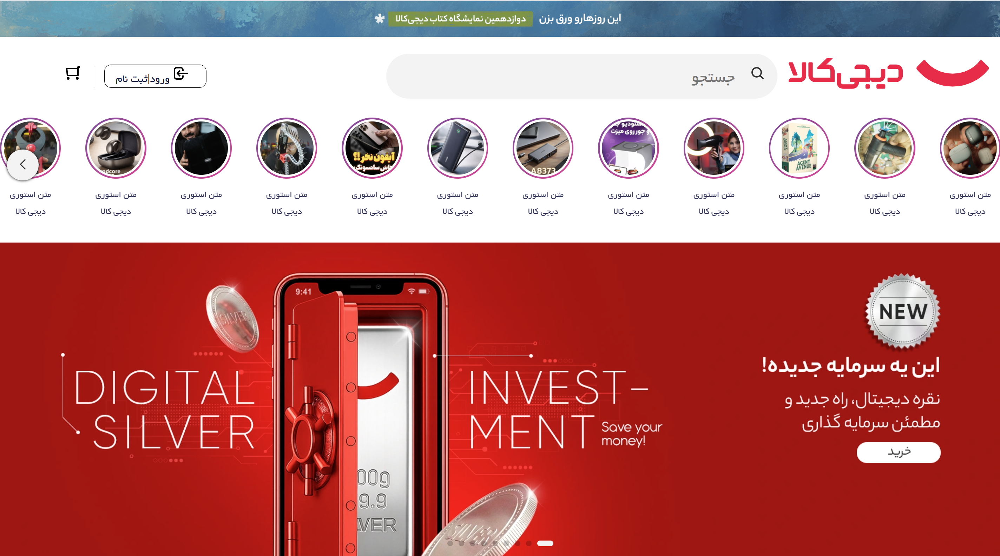

# 🛍️ Digikala Landing Page Clone

A modern and responsive clone of the Digikala homepage, built with **HTML**, **CSS**, and **Tailwind CSS**. This project focuses on creating a clean, pixel-perfect user interface while maintaining responsiveness across different screen sizes.

## 🌐 Live Demo

👉 **View the project here:**
**https://pixelbysoroush.github.io/digiKala-mainPage/digikala/index.html**

---

## 📸 Preview
```markdown

```

---

## ✨ Features

* 🎨 Modern and clean UI
* 📱 Fully Responsive Design
* ⚡ Fast and lightweight
* 🛒 Digikala-inspired homepage layout
* 🧩 Reusable components
* 💻 Cross-browser compatibility
* 🎯 Pixel-perfect implementation
* 🖼️ Optimized images and layout

---

## 🛠️ Built With

* HTML5
* CSS3
* Tailwind CSS

---

## 📂 Project Structure

```text
.
├── assets/
│   ├── css/
│   └── js/
│   └── pics/
├── index.html
└── README.md
```

---

## 🚀 Getting Started

Clone the repository:

```bash
git clone https://github.com/PixelBySoroush/digiKala-mainPage.git
```

Open the project:

```bash
cd digiKala-mainPage
```

Run the project using **Live Server** or simply open `index.html` in your browser.

---

## 🎯 Project Goals

This project was created to improve front-end development skills by recreating a real-world e-commerce homepage using modern web technologies and responsive design principles.

---

## 📈 Future Improvements

* Product slider
* Dark Mode
* Search functionality
* Shopping cart UI
* Animations and transitions
* Better accessibility

---

## 👨‍💻 Author

**Soroush Reyvandi**

GitHub: https://github.com/PixelBySoroush

---

## ⭐ Support

If you like this project, consider giving it a ⭐ on GitHub. It really helps and motivates me to build more projects.

---

## 📄 License

This project is intended for educational and portfolio purposes only.

Digikala® is a registered trademark of its respective owners. This repository is **not affiliated with or endorsed by Digikala**.

